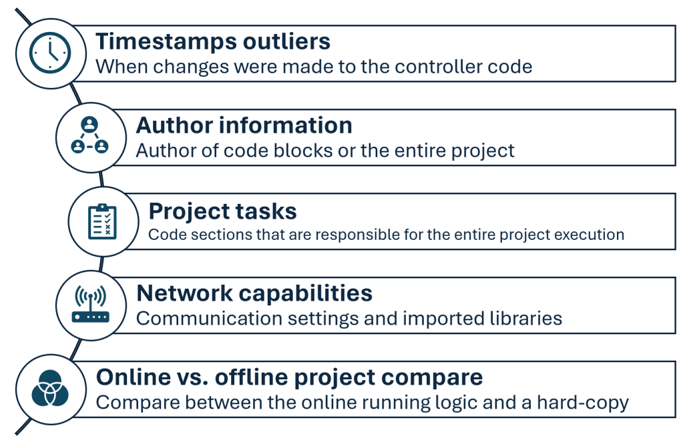
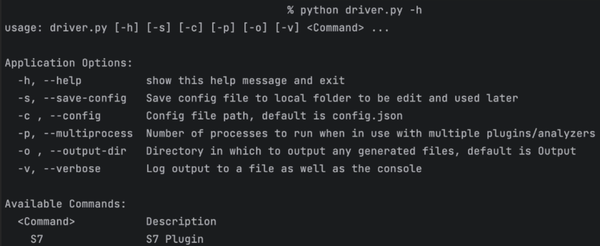
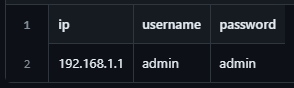

<p align="center"></p>


# [ICSpector: How-To Guide](https://azure.microsoft.com/en-us/products/iot-defender/)

## Introduction
The security of Industrial Control Systems (ICS) has been a matter of concern for many years due to state-sponsored ICS-targeting malware, supply-chain attacks, and spying concerns. The potential harm from a breach to critical infrastructure such as water treatment facilities, power plants, and nuclear reactors is significant. Unfortunately, forensics for ICS devices are not as advanced as in IT environments, which can hinder investigations into incidents. To address this challenge, Microsoft has developed ICSpector, an open-source framework that simplifies the process of locating and examining the information and configurations of industrial Programmable Logic Controllers (PLCs). With ICSpector, cyber security experts can detect any anomalous indicators that may compromise or manipulate their PLCs and safeguard them from adversaries.

Many operational technology (OT) security tools based on network layer monitoring provide network protection for OT/IoT environments, allowing analysts to discover their devices and respond to alerts on vulnerabilities and anomalous behavior. However, one of the biggest challenges is retrieving the code running on the PLC and scanning it as part of an incident response to understand if it was tampered with. This act requires caution, because the PLCs are actively operating vital industrial processes. This is where ICSpector can help individuals or facilities perform this task with best practices. 

## Framework overview

Written in Python and available on GitHub, ICSpector is a framework with tools that enable investigators to:
- Scan their network for programmable logic controllers.
- Extract project configuration and code from controllers.
- Detect any anomalous components within ICS environments.  

Security experts can use these forensic artifacts to identify compromised devices as part of manual verification, automated monitoring of tasks, or during incident response. The framework’s modular, flexible design makes it convenient for investigators to customize it to their specific needs.  

The framework is composed of several components that can be developed and executed separately. The overall architecture is as follows:

<p align="center">
<br><i>Figure 1: The main modules of the ICSpector framework architecture (left to right) are: input handling, network scanner, protocol plugin, data analyzer, and output.</i></p>

The network scanner identifies devices that communicate in the supported OT protocol and ensures they are responsive, based on a provided IP subnet. Alternatively, a user can provide a specific IP list that was exported from OT security products such as [MDIoT](https://www.microsoft.com/en-us/security/business/endpoint-security/microsoft-defender-iot), and the network scanner will only verify these devices are connected before beginning data extraction. After feeding the plugin the list of available devices, it extracts the PLC project metadata and logic. Then, the analyzer converts the raw data into a human-readable form and extracts different logic to highlight areas of the project artifacts that usually indicate malicious activity. The framework lets each component run independently with the required input. You can easily modify each component, adapting the operation to your current needs, such as introducing protocol changes and analysis methods or altering the output. With the framework, users gain an inventory of assets based on the protocol scanning ability. In the data extraction phase, you can create snapshots of the controller projects and then compare changes over time. 

<b>Note:</b> while the framework is not designed to disrupt the production process, due to the sensitive nature of ICS environments, we advise executing the data extracting component in a monitored environment. 

<p align="center">
<br><i>Figure 2: Anomalous artifacts that can be extracted by ICSpector include timestamps outliers, author information, tasks usage, network capabilities, and online vs. offline project compare.</i></p>

The forensic analysis component of ICSpector allows you to dive deep into malicious modifications of controller code. With the ICSpector framework, you can extract timestamp outliers indicating that someone changed the controller code at an unexpected time. Author information is provided as well to help detect suspicious code writers. Network capabilities can be extracted to surface unexpected communication ports and network libraries. Tasks are data structures that trigger the execution of the PLC project, and the framework gives you an overview of existing tasks and their configuration. Additionally, the entire call graph is exported to obtain a clear view of the execution flow. Stuxnet, a sophisticated computer worm that was responsible for causing significant damage to Iran’s nuclear program in 2010, altered a cyclic task to monitor its malicious activities and added malicious logic to the main block of the program. Since the code running on the controller may differ from an engineer’s hard copy, the framework lets you compare the differences between the online and the offline code to catch malicious changes. All of these analysis capabilities could have helped detect the presence of Stuxnet in the network. 

### Getting started

ICSpector is a novel solution that enables OT experts and cybersecurity analysts to enhance their reactive and proactive incident response capabilities in ICS environments. The OT cybersecurity community can participate in and benefit from security efforts in OT forensics and advance the vision of better security practices in the OT field. 

The following steps are required for setting an environment for executing the project:

- <b>Git clone</b>
  ```
  git clone https://github.com/microsoft/ics-forensics-tools.git
  ```
- <b>Prerequisites</b>
  - Install Python >= 3.9: https://www.python.org/downloads
  - Install Microsoft Visual C++ 14.0. Get it with "Build Tools for Visual Studio": https://visualstudio.microsoft.com/downloads/
- <b>Install python requirements</b>
    ``` 
    pip install -r requirements.txt
    ```
## Project tree

The framework’s project tree is composed of the following components: 

- <b><u>Setup.py:</b></u> Setup installation script.
- <b><u>Assets:</b></u> All the demonstrations needed for the README files. Sub directories will be used for the various plugins.
- <b><u>Requirements.txt:</b></u> Modules needed for execution of the code.
- <b><u>Dev-requirements.txt:</b></u> Modules needed for development environment.
- <b><u>README.md:</b></u> Covers the framework overall usage and architecture.
- <b><u>HowToGuide.md:</b></u> A comprehensive-version of the README file.
- <b><u>Src:</b></u> Contains the main code of the project, with the following main components:
  - Driver.py: The main script that executes the needed logic.
    - Ips.csv: .CSV file with IP addresses of PLC devices and any required credentials or IP subnet, to be used for connecting to the configured PLCs.
    - Forensics: Directory consists of interface classes to be used by the implemented plugins. Main folders are:
      - Plugins: A plugin is available for each supported OT protocol. It is being used to connect to a PLC device to get the required artifacts and program organization units (POUs) of the program that is loaded.
      - Analyzers: Each supported OT protocol can have an analyzer, that will process the raw data from the PLC device. Examples of scenarios that are supported:
        - Project files parsing: extraction of valuable information out of the extracted raw data (raw_files_parser.py)
        - Forensic artifacts extraction from parsed project files (I.e., block_logic.py, online_offline_compare.py). 

## Driver

The driver.py script is responsible for operating each component in the framework. It can be used for network scan and data extraction, analyzing raw data, printing output and setting configuration preferences.

<p align="center">
<br><i>Figure 3: command line help of the driver.py</i></p>

The driver must receive a protocol plugin to be used. More information about plugins appears later on this document. 

In addition, the driver must receive a CSV file input, which contains the PLC IP addresses and their respective credentials if needed, or an IP subnet. The network scanner component scans the network for available PLCs by the given IP addresses and credentials, through the chosen protocol (check the supported protocols). 

If the protocol supports connection to specific rack and slot, the protocol plugin can iterate on all the available racks and slots configured boundaries (a maximum rack and slot can be modified by specific needs at the specific plugin script file). 

The plugin attempts to create a communication channel between the machine and the configured PLC devices over the selected protocol. After establishing a successful connection, the plugin will attempt to extract the PLC metadata and the loaded project. 

<p align="center">
<br><i>Figure 4: example CSV file of PLC IP address and credentials</i></p>

### General application arguments:
|          Args          |                             Description                             | Required / Optional |
|:----------------------:|:-------------------------------------------------------------------:|:-------------------:|
|     `-h`, `--help`     |                   show this help message and exit                   |      Optional       |
| `-s`, `--save-config`  |               Save config file for easy future usage                |      Optional       |
|    `-c`, `--config`    |              Config file path, default is config.json               |      Optional       |
|  `-o`, `--output-dir`  | Directory in which to output any generated files, default is output |      Optional       |
|   `-v`, `--verbose`    |             Log output to a file as well as the console             |      Optional       |
| `-p`, `--multiprocess` |       Run in multiprocess mode by number of plugins/analyzers       |      Optional       |

## Plugins

Currently, the system supports the following OT protocols: Siemens S7Comm, which is compatible with the S7-300/400 series, Rockwell RSLogix, using the Common Industrial Protocol, and Codesys V3, which is a widely used SDK for industrial control devices and is implemented by different vendors. 

There are configurations that can be changed, such as the port to be used, which may vary for different environments. Detailed information about each plugin can be found in the GitHub repository, under the respective protocol plugin folder.

### Specific plugin arguments:
|      Args      |                                                                     Description                                                                      | Required / Optional |
|:--------------:|:----------------------------------------------------------------------------------------------------------------------------------------------------:|:-------------------:|
| `-h`, `--help` |                                                           show this help message and exit                                                            |      Optional       |
|     `--ip`     | Addresses file path, CIDR or IP addresses csv (ip column required). <br/>add more columns for additional info about each ip (username, pass, etc...) |      Required       |
|    `--port`    |                                                                     Port number                                                                      |      Optional       |
| `--transport`  |                                                                       tcp/udp                                                                        |      Optional       |
|  `--analyzer`  |                                                                 Analyzer name to run                                                                 |      Optional       |

### Import as a library example
```python
from forensic.client.forensic_client import ForensicClient
from forensic.interfaces.plugin import PluginConfig
forensic = ForensicClient()
plugin = PluginConfig.from_json({
    "name": "PluginName",
    "port": 123,
    "transport": "tcp",
    "addresses": [{"ip": "192.168.1.0/24"}, {"ip": "10.10.10.10"}],
    "parameters": {
    },
    "analyzers": []
})
forensic.scan([plugin])
```

## Analyzers

A protocol analyzer is the most extendable part of the framework, enabling the user to implement multiple algorithms to highlight and find interesting and anomalous artifacts within the PLC project code and metadata. For instance, the S7comm protocol analyzer implements an online vs. offline comparison, which enables comparing the PLC loaded project to a hard-copy program from the engineering workstation. 

The raw file parser is the most fundamental analyzer, as it converts the extracted PLC project code into readable data. For instance, the S7Comm protocol raw file parser analyzer turns the raw blobs into a STL code, using a MC7 byte-code* translator. After this analyzer runs, the user can run the block logic analyzer, which applies various logics to highlight key interesting forensic artifacts found in the project.

<br>* MC7 is a Siemens byte-code language, used as an intermediate language after compiling a project code. The ICSpector has a translator that retrieves back the STL code from the downloaded MC7 byte-code. 

## Executing examples in the command line
Due to the framework modular structure, the protocol plugins and analyzers can be executed separately, but keep in mind that the analyzers depend on the plugin’s output, as the PLC project code and metadata will be used by the analyzer. 

Each protocol will implement its own plugin and analyzers, with the following general command-lines: 

	 python driver.py -s -v PluginName --ip ips.csv
     python driver.py -s -v PluginName --ip ips.csv --analyzer AnalyzerName
	 (optional) python driver.py -s -v -c config.json --multiprocess

Note that the driver.py component orchestrates the entire execution flow. 

Check each protocol ReadMe file on GitHub to see how exactly you can execute the protocol plugin and its available analyzers. 

## How to contribute

Contribution to ICSpector is more than welcome! There are different ways one can contribute to the project, including: 

- Add support to a new OT protocol: implement a new protocol plugin and a protocol analyzer, to convert the extracted PLC project to a human-readable format.
- Expanding the analyzer logic that runs over the extracted data, to extract more forensic artifacts or point at suspicious activity. 

When doing so, create a branch that will contain your changes, and make sure to test it in a proper OT environment, either with a real PLC or a well-simulated environment. After that, publish a PR so the team can validate and merge the changes.

<b>Please note</b> that you can find the general guidelines and standards for contributing in the "Contributing" section at the end of the document.

### Adding plugins

It is simple to add a new plugin for a particular vendor or a set of protocols. To do so, one needs to do the following: 

- Mark the src folder as "Sources Root" when developing locally.
- Create a new folder under plugins folder with your plugin name
- Create new Python file with your plugin name
- Use the following template to write your plugin and replace 'General' with your plugin name:  

```python
from pathlib import Path
from forensic.interfaces.plugin import PluginInterface, PluginConfig, PluginCLI
from forensic.common.constants.constants import Transport


class GeneralCLI(PluginCLI):
    def __init__(self, folder_name):
        super().__init__(folder_name)
        self.name = "General"
        self.description = "General Plugin Description"
        self.port = 123
        self.transport = Transport.TCP

    def flags(self, parser):
        self.base_flags(parser, self.port, self.transport)
        parser.add_argument('--general', help='General additional argument', metavar="")


class General(PluginInterface):
    def __init__(self, config: PluginConfig, output_dir: Path, verbose: bool):
        super().__init__(config, output_dir, verbose)

    def connect(self, address):
        self.logger.info(f"{self.config.name} connect")

    def export(self, extracted):
        self.logger.info(f"{self.config.name} export")


```

Keep in mind the following points:
- Make sure to import your new plugin in the `__init__.py` file under the plugins folder
- In the PluginInterface inherited class there is 'config' parameters, you can use this to access any data that's available in the PluginConfig object (plugin name, addresses, port, transport, parameters).  
There are 2 mandatory functions (connect, export).  
  - The connect function receives single ip address and extracts any relevant information from the device and return it.  
  - The export function receives the information that was extracted from __all__ the devices and there you can export it to file.
- In the PluginCLI inherited class you need to specify in the init function the default information related to this plugin.  
There is a single mandatory function (flags), in which you must call base_flags, and you can add any additional flags that you want to have.

### Adding analyzers

An analyzer is a component within the framework that relies on the extracted raw data from the relevant plugin. Its main role is to extract the relevant information from the PLC project code and classify key components. An analyzer can implement sophisticated algorithms, to assist the end user in detecting any anomalous forensic indicators in the PLC data. For instance, the analyzer can flag any changes in the PLC code that do not match the expected configuration or behavior. 

To implement an analyzer for a specific OT protocol, do the following: 

Create a new folder under analyzers folder with the plugin name that related to your analyzer. 

Create a new Python file named after your analyzer. 

Use the following template to write your plugin and replace 'General' with your plugin name:

```python
from pathlib import Path
from forensic.interfaces.analyzer import AnalyzerInterface, AnalyzerConfig


class General(AnalyzerInterface):
    def __init__(self, config: AnalyzerConfig, output_dir: Path, verbose: bool):
        super().__init__(config, output_dir, verbose)
        self.plugin_name = 'General'
        self.create_output_dir(self.plugin_name)

    def analyze(self):
      pass

```

- Make sure to import your new analyzer in the `__init__.py` file under the analyzers folder

## Resources and technical data & solution:

[Microsoft Defender for IoT](https://azure.microsoft.com/en-us/services/iot-defender/#overview) is an agentless network-layer security solution that allows
organizations to continuously monitor and discover assets, detect threats, and manage vulnerabilities in their IoT/OT
and Industrial Control Systems (ICS) devices, on-premises and in Azure-connected environments.

[Section 52 under MSRC blog](https://msrc-blog.microsoft.com/?s=section+52)    <br/>
[ICS Lecture given about the tool](https://ics2022.sched.com/event/15DB2/deep-dive-into-plc-ladder-logic-forensics)    <br/>
[Section 52 - Investigating Malicious Ladder Logic | Microsoft Defender for IoT Webinar - YouTube](https://www.youtube.com/watch?v=g3KLq_IHId4&ab_channel=MicrosoftSecurityCommunity)

## Contributing

This project welcomes contributions and suggestions. Most contributions require you to agree to a
Contributor License Agreement (CLA) declaring that you have the right to, and actually do, grant us
the rights to use your contribution. For details, visit https://cla.opensource.microsoft.com.

When you submit a pull request, a CLA bot will automatically determine whether you need to provide
a CLA and decorate the PR appropriately (e.g., status check, comment). Simply follow the instructions
provided by the bot. You will only need to do this once across all repos using our CLA.

This project has adopted the [Microsoft Open Source Code of Conduct](https://opensource.microsoft.com/codeofconduct/).
For more information see the [Code of Conduct FAQ](https://opensource.microsoft.com/codeofconduct/faq/) or
contact [opencode@microsoft.com](mailto:opencode@microsoft.com) with any additional questions or comments.

## Trademarks

This project may contain trademarks or logos for projects, products, or services. Authorized use of Microsoft
trademarks or logos is subject to and must follow
[Microsoft's Trademark & Brand Guidelines](https://www.microsoft.com/en-us/legal/intellectualproperty/trademarks/usage/general).
Use of Microsoft trademarks or logos in modified versions of this project must not cause confusion or imply Microsoft sponsorship.
Any use of third-party trademarks or logos are subject to those third-party's policies.

## Legal Disclaimer

Copyright (c) 2018 Microsoft Corporation. All rights reserved.

THE SOFTWARE IS PROVIDED "AS IS", WITHOUT WARRANTY OF ANY KIND, EXPRESS OR
IMPLIED, INCLUDING BUT NOT LIMITED TO THE WARRANTIES OF MERCHANTABILITY,
FITNESS FOR A PARTICULAR PURPOSE AND NONINFRINGEMENT. IN NO EVENT SHALL THE
AUTHORS OR COPYRIGHT HOLDERS BE LIABLE FOR ANY CLAIM, DAMAGES OR OTHER
LIABILITY, WHETHER IN AN ACTION OF CONTRACT, TORT OR OTHERWISE, ARISING FROM,
OUT OF OR IN CONNECTION WITH THE SOFTWARE OR THE USE OR OTHER DEALINGS IN THE SOFTWARE.
