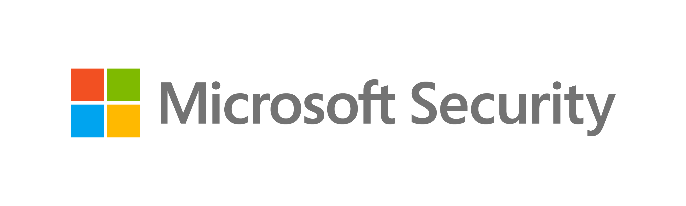
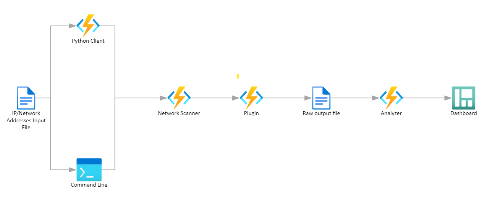

<p align="center"></p>


# [ICSpector: Microsoft ICS Forensics Framework](https://azure.microsoft.com/en-us/products/iot-defender/)

Microsoft ICS Forensics Tools framework is an open-source forensics framework that enables the analysis of Industrial PLC metadata and project files.
<br>The framework provides investigators with a convenient way to scan for PLCs and identify any suspicious artifacts within ICS environments, which can be used for manual checking, automated monitoring tasks, or incident response operations to detect compromised devices.
<br>By being an open-source tool, ICS Forensics Tools allows investigators to review the output and customize it to their specific requirements.

## Getting Started

These instructions will get you a copy of the project up and running on your local machine for development and testing purposes.
```
git clone https://github.com/microsoft/ics-forensics-tools.git
```

### Prerequisites

- Install Python >= 3.9: https://www.python.org/downloads
- Install Microsoft Visual C++ 14.0. Get it with "Build Tools for Visual Studio": https://visualstudio.microsoft.com/downloads/

### Installing

- Install python requirements

    ``` 
    pip install -r requirements.txt
    ```
## Usage

### General application arguments:
|          Args          |                             Description                             | Required / Optional |
|:----------------------:|:-------------------------------------------------------------------:|:-------------------:|
|     `-h`, `--help`     |                   show this help message and exit                   |      Optional       |
| `-s`, `--save-config`  |               Save config file for easy future usage                |      Optional       |
|    `-c`, `--config`    |              Config file path, default is config.json               |      Optional       |
|  `-o`, `--output-dir`  | Directory in which to output any generated files, default is output |      Optional       |
|   `-v`, `--verbose`    |             Log output to a file as well as the console             |      Optional       |
| `-p`, `--multiprocess` |       Run in multiprocess mode by number of plugins/analyzers       |      Optional       |

### Specific plugin arguments:
|      Args      |                                                                     Description                                                                      | Required / Optional |
|:--------------:|:----------------------------------------------------------------------------------------------------------------------------------------------------:|:-------------------:|
| `-h`, `--help` |                                                           show this help message and exit                                                            |      Optional       |
|     `--ip`     | Addresses file path, CIDR or IP addresses csv (ip column required). <br/>add more columns for additional info about each ip (username, pass, etc...) |      Required       |
|    `--port`    |                                                                     Port number                                                                      |      Optional       |
| `--transport`  |                                                                       tcp/udp                                                                        |      Optional       |
|  `--analyzer`  |                                                                 Analyzer name to run                                                                 |      Optional       |

### Executing examples in the command line
	 python driver.py -s -v PluginName --ip ips.csv
     python driver.py -s -v PluginName --ip ips.csv --analyzer AnalyzerName
	 python driver.py -s -v -c config.json --multiprocess


### Import as library example
```python
from forensic.client.forensic_client import ForensicClient
from forensic.interfaces.plugin import PluginConfig
forensic = ForensicClient()
plugin = PluginConfig.from_json({
    "name": "PluginName",
    "port": 123,
    "transport": "tcp",
    "addresses": [{"ip": "192.168.1.0/24"}, {"ip": "10.10.10.10"}],
    "parameters": {
    },
    "analyzers": []
})
forensic.scan([plugin])
```
## Architecture


## Adding Plugins
When developing locally make sure to mark src folder as "Sources root"

- Create new directory under plugins folder with your plugin name
- Create new Python file with your plugin name
- Use the following template to write your plugin and replace 'General' with your plugin name

```python
from pathlib import Path
from forensic.interfaces.plugin import PluginInterface, PluginConfig, PluginCLI
from forensic.common.constants.constants import Transport


class GeneralCLI(PluginCLI):
    def __init__(self, folder_name):
        super().__init__(folder_name)
        self.name = "General"
        self.description = "General Plugin Description"
        self.port = 123
        self.transport = Transport.TCP

    def flags(self, parser):
        self.base_flags(parser, self.port, self.transport)
        parser.add_argument('--general', help='General additional argument', metavar="")


class General(PluginInterface):
    def __init__(self, config: PluginConfig, output_dir: Path, verbose: bool):
        super().__init__(config, output_dir, verbose)

    def connect(self, address):
        self.logger.info(f"{self.config.name} connect")

    def export(self, extracted):
        self.logger.info(f"{self.config.name} export")


```
- Make sure to import your new plugin in the `__init__.py` file under the plugins folder
- In the PluginInterface inherited class there is 'config' parameters, you can use this to access any data that's available in the PluginConfig object (plugin name, addresses, port, transport, parameters).  
there are 2 mandatory functions (connect, export).  
the connect function receives single ip address and extracts any relevant information from the device and return it.  
the export function receives the information that was extracted from __all__ the devices and there you can export it to file.
- In the PluginCLI inherited class you need to specify in the init function the default information related to this plugin.  
there is a single mandatory function (flags).  
In which you must call base_flags, and you can add any additional flags that you want to have.

## Adding Analyzers
- Create new directory under analyzers folder with the plugin name that related to your analyzer.
- Create new Python file with your analyzer name
- Use the following template to write your plugin and replace 'General' with your plugin name
```python
from pathlib import Path
from forensic.interfaces.analyzer import AnalyzerInterface, AnalyzerConfig


class General(AnalyzerInterface):
    def __init__(self, config: AnalyzerConfig, output_dir: Path, verbose: bool):
        super().__init__(config, output_dir, verbose)
        self.plugin_name = 'General'
        self.create_output_dir(self.plugin_name)

    def analyze(self):
      pass

```

- Make sure to import your new analyzer in the `__init__.py` file under the analyzers folder

## Resources and Technical data & solution:
[Microsoft Defender for IoT](https://azure.microsoft.com/en-us/services/iot-defender/#overview) is an agentless network-layer security solution that allows
organizations to continuously monitor and discover assets, detect threats, and manage vulnerabilities in their IoT/OT
and Industrial Control Systems (ICS) devices, on-premises and in Azure-connected environments.

[Section 52 under MSRC blog](https://msrc-blog.microsoft.com/?s=section+52)    <br/>
[ICS Lecture given about the tool](https://ics2022.sched.com/event/15DB2/deep-dive-into-plc-ladder-logic-forensics)    <br/>
[Section 52 - Investigating Malicious Ladder Logic | Microsoft Defender for IoT Webinar - YouTube](https://www.youtube.com/watch?v=g3KLq_IHId4&ab_channel=MicrosoftSecurityCommunity)

## Contributing

This project welcomes contributions and suggestions.  Most contributions require you to agree to a
Contributor License Agreement (CLA) declaring that you have the right to, and actually do, grant us
the rights to use your contribution. For details, visit https://cla.opensource.microsoft.com.

When you submit a pull request, a CLA bot will automatically determine whether you need to provide
a CLA and decorate the PR appropriately (e.g., status check, comment). Simply follow the instructions
provided by the bot. You will only need to do this once across all repos using our CLA.

This project has adopted the [Microsoft Open Source Code of Conduct](https://opensource.microsoft.com/codeofconduct/).
For more information see the [Code of Conduct FAQ](https://opensource.microsoft.com/codeofconduct/faq/) or
contact [opencode@microsoft.com](mailto:opencode@microsoft.com) with any additional questions or comments.

## Trademarks

This project may contain trademarks or logos for projects, products, or services. Authorized use of Microsoft
trademarks or logos is subject to and must follow
[Microsoft's Trademark & Brand Guidelines](https://www.microsoft.com/en-us/legal/intellectualproperty/trademarks/usage/general).
Use of Microsoft trademarks or logos in modified versions of this project must not cause confusion or imply Microsoft sponsorship.
Any use of third-party trademarks or logos are subject to those third-party's policies.

## Legal Disclaimer

Copyright (c) 2018 Microsoft Corporation. All rights reserved.

THE SOFTWARE IS PROVIDED "AS IS", WITHOUT WARRANTY OF ANY KIND, EXPRESS OR
IMPLIED, INCLUDING BUT NOT LIMITED TO THE WARRANTIES OF MERCHANTABILITY,
FITNESS FOR A PARTICULAR PURPOSE AND NONINFRINGEMENT. IN NO EVENT SHALL THE
AUTHORS OR COPYRIGHT HOLDERS BE LIABLE FOR ANY CLAIM, DAMAGES OR OTHER
LIABILITY, WHETHER IN AN ACTION OF CONTRACT, TORT OR OTHERWISE, ARISING FROM,
OUT OF OR IN CONNECTION WITH THE SOFTWARE OR THE USE OR OTHER DEALINGS IN THE SOFTWARE.
