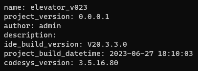
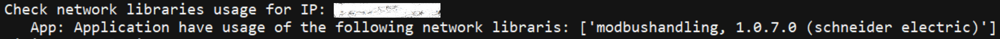
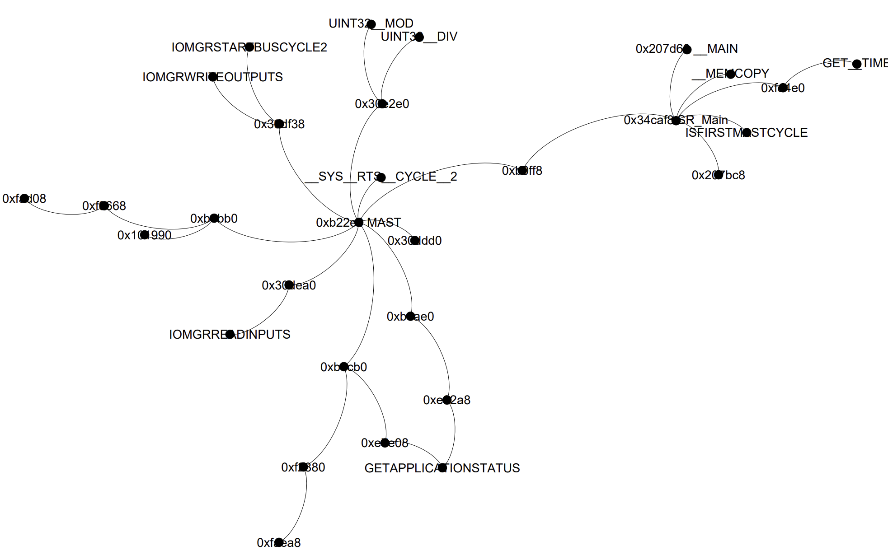
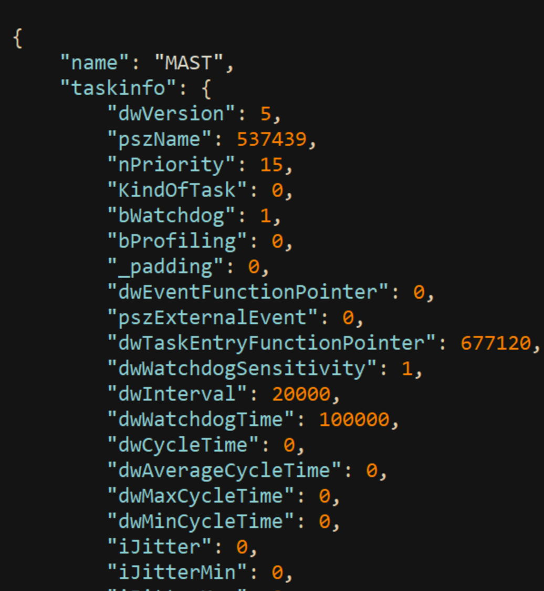

## SUPPORTED SCENARIOS
- Tasks usage
- Project Metadata
- Call Graph
- Network usage

### Analyzers arguments:
#### CS3BlockLogic
| **args**                    | **Description**							     | **Must / Optional** |
|-----------------------------|----------------------------|---------------------|
| `--logic_all`					          | Execute all logic options	 | optional            |
| `--logic_author`				        | Execute author logic       | optional            |
| `--logic_dates`					        | Execute dates logic        | optional            |
| `--logic_project_info`					 | Execute project info logic    | optional            |
| `--logic_network`				       | Execute network logic      | optional            |
| `--logic_tasks`						       | Execute tasks logic        | optional            |

### Execute the following commands in this order
	 python driver.py -s -v CodeSysV3 --ip ips.csv
     python driver.py -s -v CodeSysV3 --ip ips.csv --analyzer CS3RawFileParser
     python driver.py -s -v CodeSysV3 --ip ips.csv --analyzer CS3BlockLogic --logic_all

#### PLC authentication
Authentication with username and password is supported.

### Output:
Depending on the model you choose to investigate, the data presented per model.
- The uploaded PLC project with parsed metadata
- Project Metadata and uniqueness
 
- Network libraries usage
 
- Call graph - program connection based execution graph
 
- Tasks usage
 

## Resources and Technical data & solution:
[Microsoft Defender for IoT](https://azure.microsoft.com/en-us/services/iot-defender/#overview) is an agentless network-layer security solution that allows
organizations to continuously monitor and discover assets, detect threats, and manage vulnerabilities in their IoT/OT
and Industrial Control Systems (ICS) devices, on-premises and in Azure-connected environments.

[Section 52 under MSRC blog](https://msrc-blog.microsoft.com/?s=section+52)     
[ICS Lecture given about the tool](https://ics2022.sched.com/event/15DB2/deep-dive-into-plc-ladder-logic-forensics)     
[Section 52 - Investigating Malicious Ladder Logic | Microsoft Defender for IoT Webinar - YouTube](https://www.youtube.com/watch?v=g3KLq_IHId4&ab_channel=MicrosoftSecurityCommunity)
