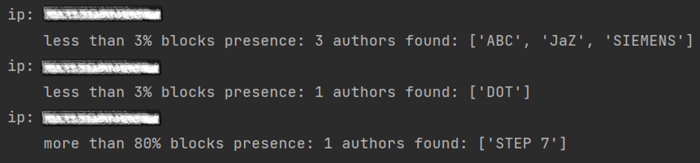
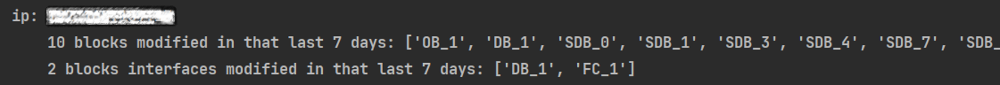
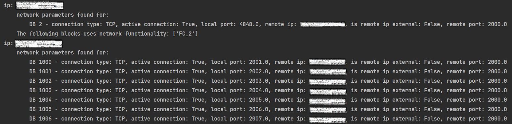
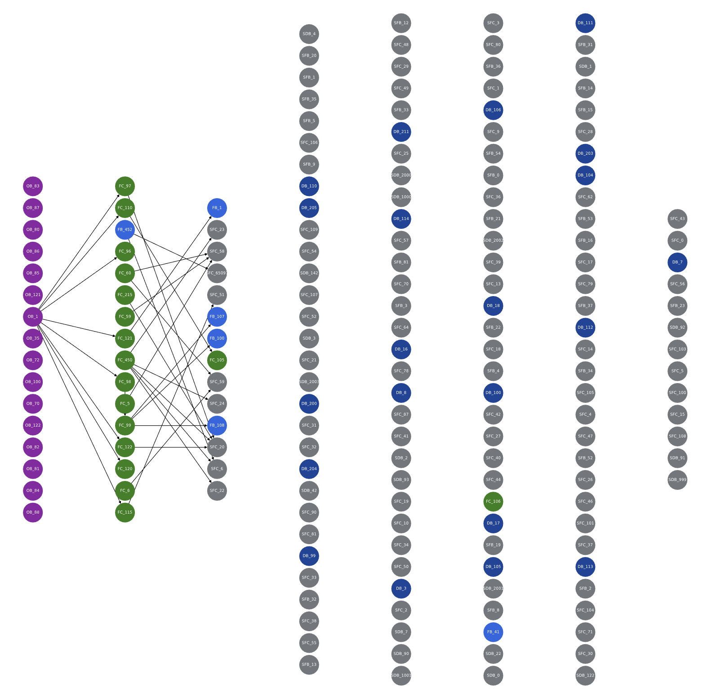
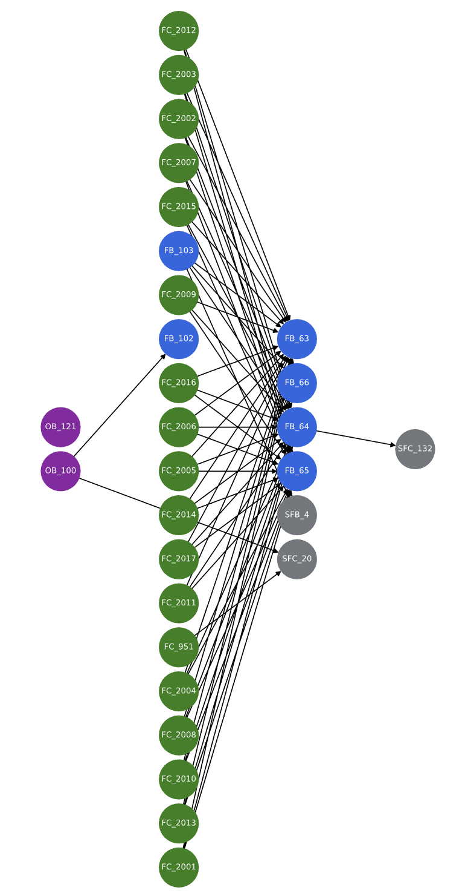
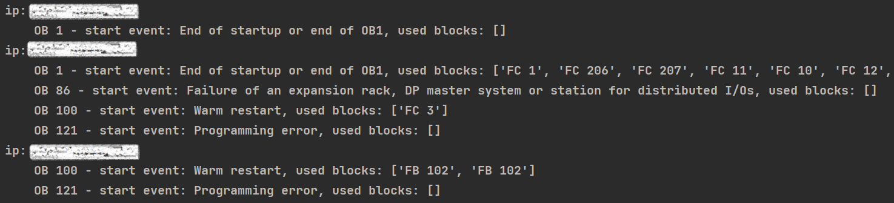

## SUPPORTED SCENARIOS
- OB usage
- Block author
- Offline - Online comparison
- Call Graph
- Timestamps outliers
- Network usage

### Analyzers arguments:
#### S7BlockLogic
| **args**              | **Description**							                    | **Must / Optional** |
|-----------------------|-------------------------------------------|---------------------|
| `--logic_all`					    | Execute all logic options	                | optional            |
| `--logic_author`				  | Execute author logic                      | optional            |
| `--logic_dates`					  | Execute dates logic                       | optional            |
| `--logic_network`				 | Execute network logic                     | optional            |
| `--logic_ob`						    | Execute organizational blocks logic       | optional            |

#### S7OnlineOfflineCompare
| **args**              | **Description**							                    | **Must / Optional** |
|-----------------------|-------------------------------------------|---------------------|
| `--compare_ip`					   | PLC IP with online blocks to compare					 | must                |
| `--project_dir`	     | Offline projects directory	           | optional            |
| `--project_name`	     | Offline project directory name	           | optional            |

### Execute the following commands in this order
	 python driver.py -s -v S7 --ip ips.csv
     python driver.py -s -v S7 --ip ips.csv --analyzer S7RawFileParser
     python driver.py -s -v S7 --ip ips.csv --analyzer S7BlockLogic --logic_all
     (Optional) python driver.py -s -v S7 --ip ips.csv --analyzer S7OnlineOfflineCompare --compare_ip <plc_ip>

#### PLC authentication
Authentication with username and password is not supported.

### Output:
Depending on the model you choose to investigate, the data presented per model.
- The uploaded PLC project with parsed metadata
- Author block names and uniqueness
 
- Timestamp Outliers Anomalies
 
- Network Logic
 
- Call graph - program connection based execution graph
 
 
- OB metadata
 
- Online <-> Offline Block Comparison
 

## Resources and Technical data & solution:
[Microsoft Defender for IoT](https://azure.microsoft.com/en-us/services/iot-defender/#overview) is an agentless network-layer security solution that allows
organizations to continuously monitor and discover assets, detect threats, and manage vulnerabilities in their IoT/OT
and Industrial Control Systems (ICS) devices, on-premises and in Azure-connected environments.

[Section 52 under MSRC blog](https://msrc-blog.microsoft.com/?s=section+52)     
[ICS Lecture given about the tool](https://ics2022.sched.com/event/15DB2/deep-dive-into-plc-ladder-logic-forensics)     
[Section 52 - Investigating Malicious Ladder Logic | Microsoft Defender for IoT Webinar - YouTube](https://www.youtube.com/watch?v=g3KLq_IHId4&ab_channel=MicrosoftSecurityCommunity)
